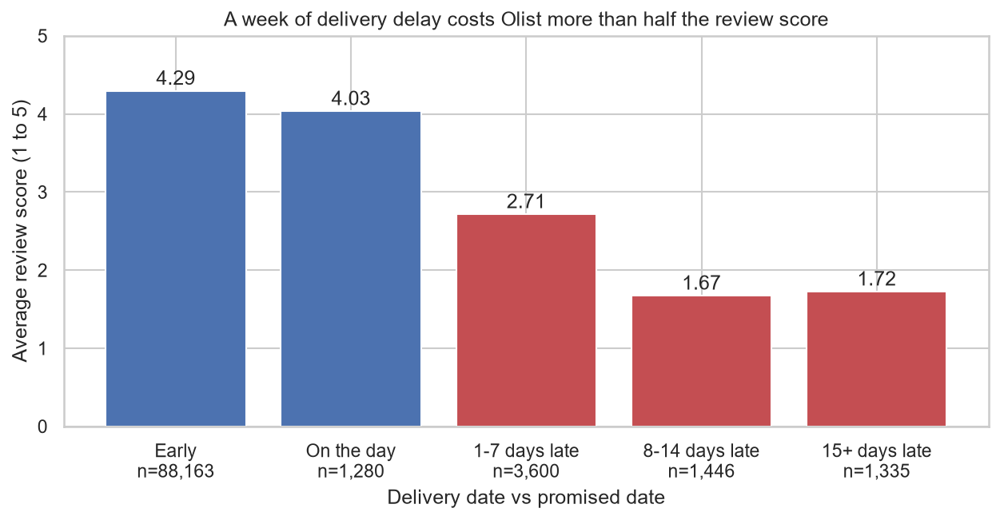
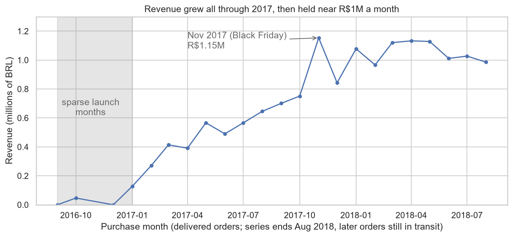
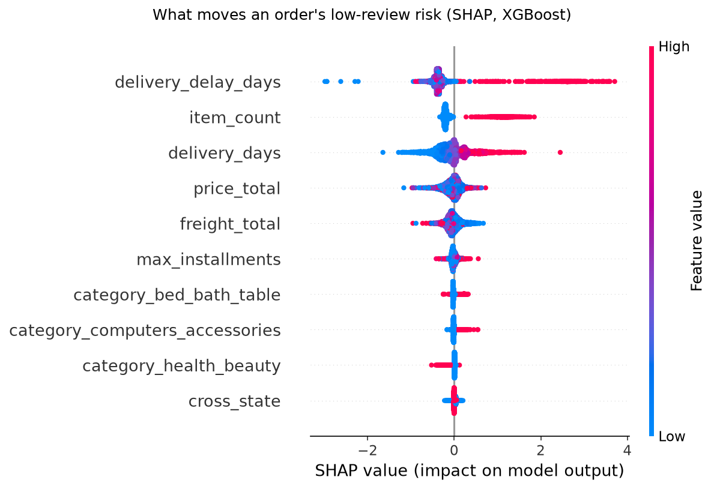
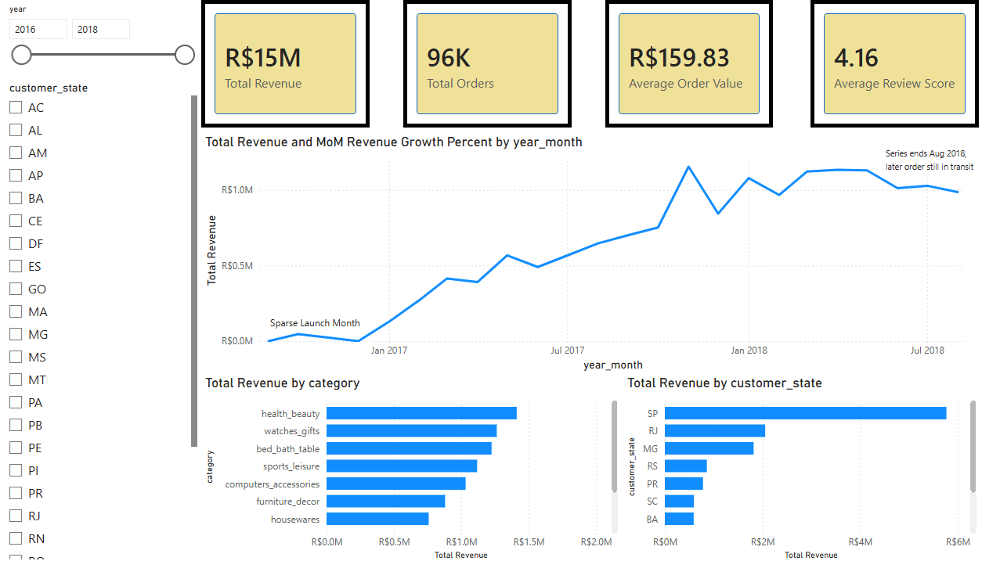
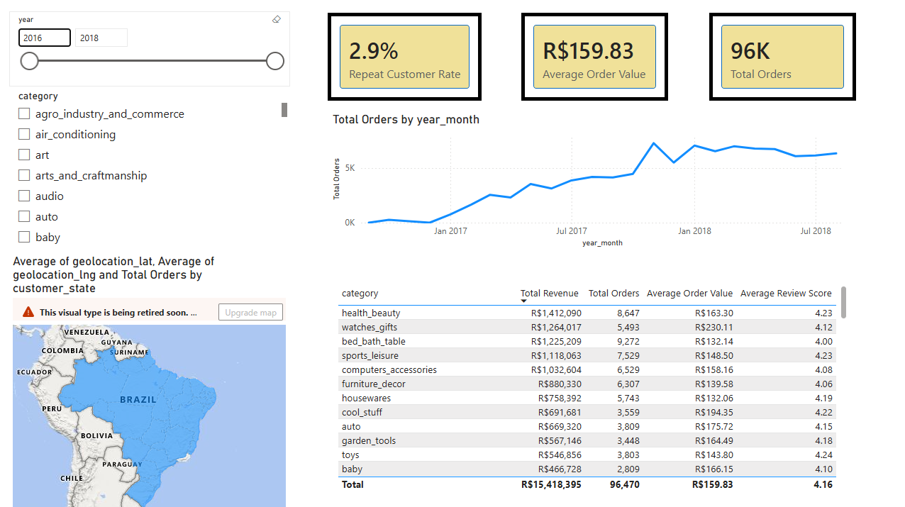
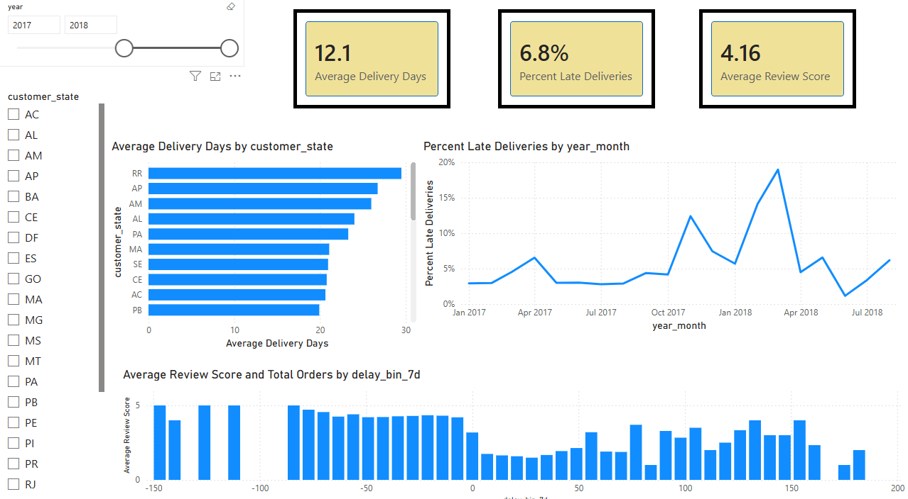

# Olist e-commerce analytics

End-to-end analysis of 99,441 orders from the Brazilian marketplace Olist, September 2016 to October 2018: where the revenue sits, why customers leave, how deliveries break, and a model that flags 1-2 star reviews before customers write them.

## The question

Olist connects small Brazilian retailers to large marketplaces. Leadership wants to know four things: where revenue comes from and how it trends, what the customer base looks like, how delivery performance affects review scores, and whether the company can catch orders headed for a 1 or 2 star review early enough to intervene.

## The data

Nine relational CSV files from [Kaggle](https://www.kaggle.com/datasets/olistbr/brazilian-ecommerce): orders, order items, payments, reviews, customers, products, sellers, geolocation, and a category translation table. The raw files stay out of the repo; `python src/download_data.py` pulls all nine from Kaggle into `data/raw/`, no Kaggle account needed, and then everything below reproduces.

## Architecture

CSV to pandas (audit and cleaning) to SQL Server LocalDB (star schema and analysis queries) to Power BI (dashboard), with scikit-learn and XGBoost for the prediction model.

## Four findings

**1. A week of delivery delay costs more than half the review score.** Orders that arrive early average 4.29 stars. At 1 to 7 days late the average drops to 2.71, and at 8 to 14 days late it is 1.67, with 80% of those orders rated 1 or 2 stars. Only 6.8% of deliveries run late, so the pain sits in a narrow, addressable slice of orders.



**2. Customers do not come back, and the window to change that is short.** Only 3.0% of 93,350 customers ever place a second delivered order. Those who do return fast: half within 28 days, 68% within 90. Any retention play has about three months to land.

**3. The business is concentrated twice over.** Three states (SP, RJ, MG) hold 62.5% of the R$15.4M in delivered revenue, and 18 of 74 product categories hold 80% of it. Revenue peaked at R$1.15M in November 2017, Black Friday, then held near R$1M a month through 2018.



**4. A model can flag the bad reviews before customers write them.** An XGBoost classifier using only features known by delivery time (delay, price, freight, item count, category, payment) reaches PR-AUC 0.464 against a 0.128 no-skill floor. Flagging the riskiest 19.4% of orders catches 54.8% of all coming 1-2 star reviews at 36.2% precision, 2.8 times the base rate. Delivery delay is the strongest driver in the SHAP analysis, so the same model can score in-flight orders daily and surface trouble before the parcel lands.



## Dashboard

Three Power BI pages built on five SQL views: Executive Overview, Customer Analytics, Delivery Operations. The spec, DAX measures, and connection guide are in `powerbi/`.






## Reproduce it

1. `python -m venv .venv`, activate it, `pip install -r requirements.txt` (Python 3.12).
2. `python src/download_data.py` pulls the 9 Kaggle CSVs into `data/raw/`.
3. Run `notebooks/01_data_audit_cleaning.ipynb` top to bottom. It writes cleaned parquet to `data/processed/`.
4. Start LocalDB (`sqllocaldb start MSSQLLocalDB`), then `python src/load_to_sql.py`. One command: it creates the `olist` database if missing, rebuilds the schema, loads all tables, fails if any SQL row count differs from parquet, and creates the five Power BI views.
5. `sql/02_analysis_queries.sql` holds the analysis queries; sample results are in `sql/02_query_results.md`.
6. Run `notebooks/02_eda.ipynb` and `notebooks/03_review_model.ipynb`.
7. For the dashboard, follow `powerbi/connection_guide.md`. The DAX file lists the exact numbers your build must reproduce, so the trail from raw CSV to dashboard stays verifiable end to end.

## Repository structure

```
olist-ecommerce-analytics/
|-- README.md
|-- requirements.txt
|-- data/                 raw and processed data, not committed
|-- notebooks/
|   |-- 01_data_audit_cleaning.ipynb   audit, cleaning decisions, parquet output
|   |-- 02_eda.ipynb                   the four findings and seven figures
|   |-- 03_review_model.ipynb          low-review prediction, SHAP analysis
|-- src/
|   |-- download_data.py               pulls the 9 CSVs from Kaggle into data/raw
|   |-- load_to_sql.py                 parquet to LocalDB: schema, load, parity check, views
|-- sql/
|   |-- 01_schema.sql                  tables, keys, measured types
|   |-- 02_analysis_queries.sql        six business questions in T-SQL
|   |-- 03_powerbi_views.sql           star schema views
|-- powerbi/
|   |-- dax_measures.md                eight measures with validation targets
|   |-- dashboard_spec.md              three pages, exact field wells
|   |-- connection_guide.md            LocalDB to Power BI, step by step
|-- reports/figures/                   nine standalone PNG figures
|-- docs/
    |-- data_dictionary.md             every table, column, and cleaning rule
```
